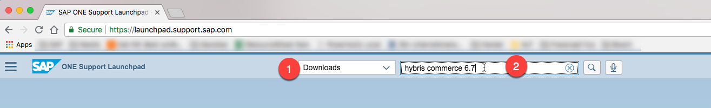
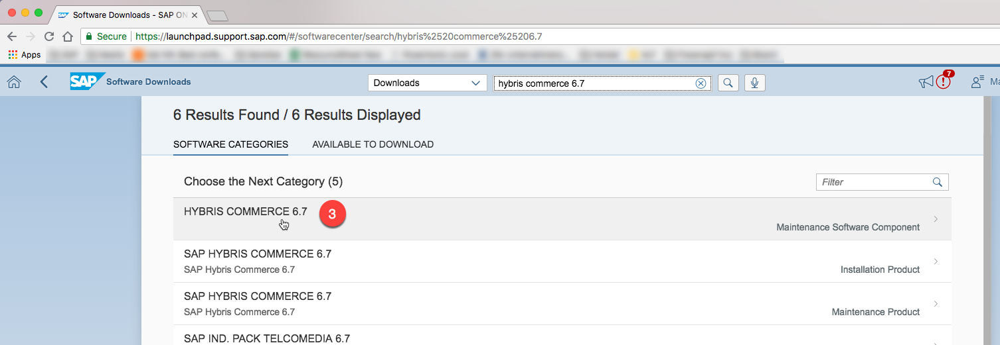
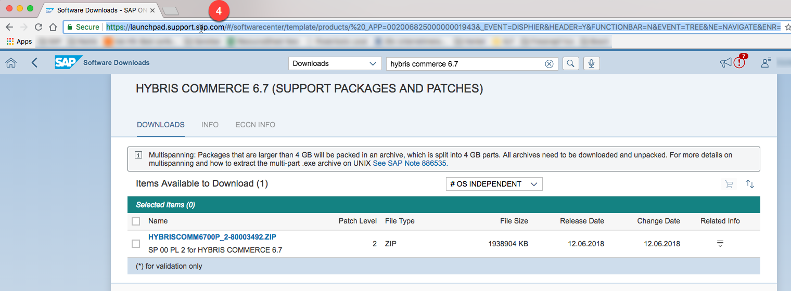
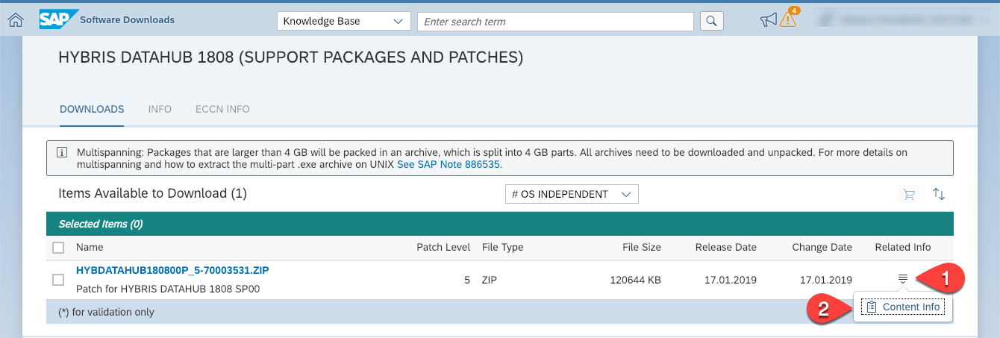
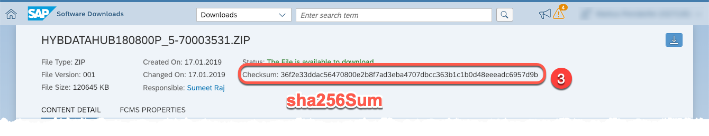

# FAQ

## How do I automate downloads from launchpad.support.sap.com?

Using some revere engineering you can easily configure e.g. a Gradle download task ([Github][dlgh], [gradle plugin][dlplug])
to download the SAP Commerce artifacts for you.

Let's say you want to download the Commere platform version 2005.

1. Search for the download on [launchpad.support.sap.com][launch] (`cx comm` is the search term that consistently works)
1. Navigate to the [download][down])
1. Click on the icon in the "Related Info" column, click on "Content Info"
1. A new page opens
1. Now, the fun part:\
   Use the last part of the URL (after `object/`) of this page to construct the download URL:
   ```
   https://launchpad.support.sap.com/#/softwarecenter/object/0020000001554412020
                                                             ─────────┬─────────
   ---becomes-->                                   ┌──────────────────┘
                                                   v
   https://softwaredownloads.sap.com/file/0020000001554412020
   ```
1. Voila, you now have the download URL. Provide the S-User and its password using HTTP Basic authentication, and you are done.

Here is how you would do it with `curl`:

```sh
❯ curl -L -b cookies.txt \
  -u S1234567890 \
  -o hybris-commerce-suite-2005.3.zip \
  https://softwaredownloads.sap.com/file/0020000001554412020
...
100 1483M  100 1483M    0     0  6450k      0  0:03:55  0:03:55 --:--:-- 7130k
```

The field "Checksum" of the content info page is the sha-256 hash of the file (that comes in handy if you want to verify the download)

```sh
❯ shasum -a 256 -c <<< 'b44bc237f3b525759411aa6aed6d1e9bec8a8c6d8ed1c7823b89cc3741f836d0 *hybris-commerce-suite-2005.3.zip'
hybris-commerce-suite-2005.3.zip: OK
```

[launch]: https://launchpad.support.sap.com
[down]: https://launchpad.support.sap.com/#/softwarecenter/template/products/%20_APP=00200682500000001943&_EVENT=DISPHIER&HEADER=Y&FUNCTIONBAR=N&EVENT=TREE&NE=NAVIGATE&ENR=73555000100200012039&V=MAINT&TA=ACTUAL&PAGE=SEARCH/CX%20COMMERCE%202005


[dlgh]: https://github.com/michel-kraemer/gradle-download-task
[dlplug]: https://plugins.gradle.org/plugin/de.undercouch.download

## What is the URL I should use for `supportPortalUrl` of the `SupportPortalDownload` task?

Search for "hybris commerce" Downloads in the SAP Support Portal, click on the version you want to use and use this URL.

1. Go to https://launchpad.support.sap.com/ and login
1. Switch the category to downloads (1) and search for the version (2) (use the search string `hybris <version>` to get the best result)
  
1. Click on the "Maintenance Software Component" in the results (3) \
   *Make sure to use the "Maintenance Software Component", because only those contain a single download package!*
  
1. Copy the URL (4). This is the `supportPortalUrl` you have to use for the task.
  

## Where do I find the `sha256Sum` value for a SAP Commerce distribution in the SAP Support Portal?

Those can be found in the "Related Info" (1) -> "Content Info" (2), Field "Checksum" (3)




