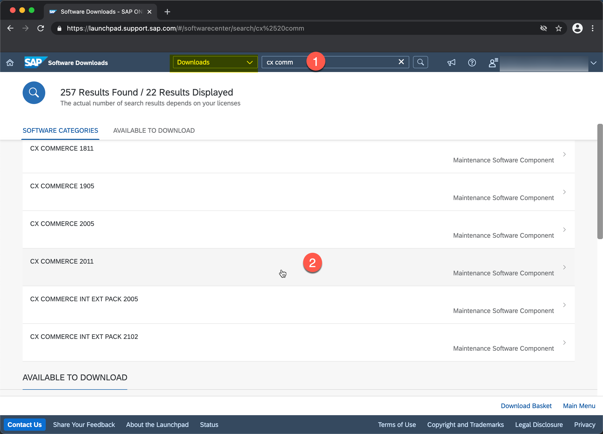
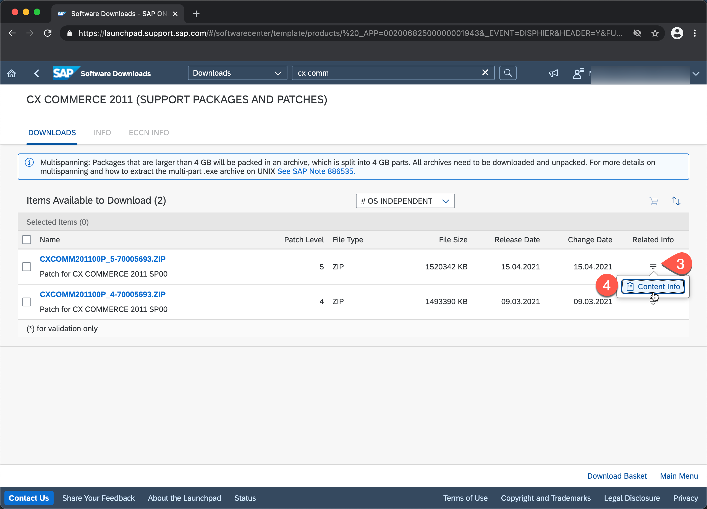
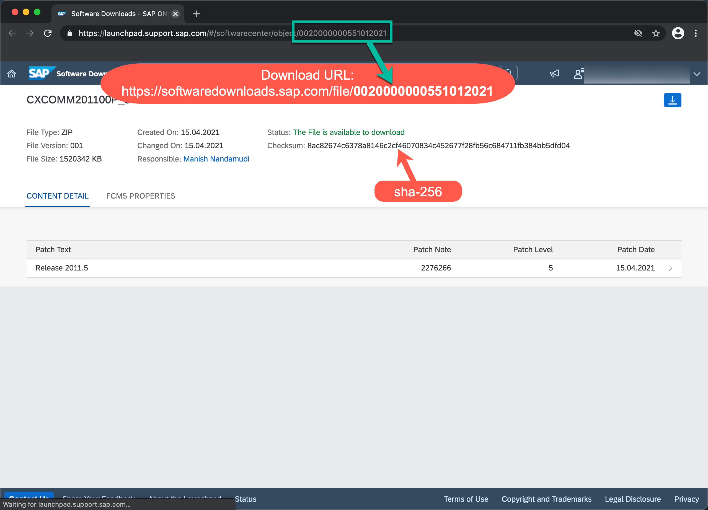

# FAQ

## <a id="downloadPlatform"></a>How do I automate downloads from launchpad.support.sap.com?

Using some revere engineering you can easily configure e.g. a Gradle download task ([Gradle plugin][dlplug])
to download the SAP Commerce artifacts for you.

Let's say you want to download SAP Commerce 2011.

1. Search for the download on [launchpad.support.sap.com][launch] (`cx comm` is the search term that consistently works)
1. Navigate to the [download][down]
   
1. Click on the icon in the "Related Info" column, click on "Content Info"
1. A new page opens
   
1. Now, the fun part:\
   Use the last part of the URL (after `object/`) of this page to construct the download URL:
   ```
   https://launchpad.support.sap.com/#/softwarecenter/object/0020000000342432021
                                                             ─────────┬─────────
                                                   ┌──────────────────┘
                                                   v
   https://softwaredownloads.sap.com/file/0020000000342432021
   ```
1. Voilà, you now have the download URL.\
   Provide your S-User and its password using HTTP Basic authentication, and you are done.
   

Here is how you would do it with `curl`:

```sh
❯ curl -L -b cookies.txt \
  -u S1234567890 \
  -o hybris-commerce-suite-2011.4.zip \
  https://softwaredownloads.sap.com/file/0020000000342432021
...
100 1483M  100 1483M    0     0  6450k      0  0:03:55  0:03:55 --:--:-- 7130k
```

Another way to download via `curl`, if the approach above does not work, e.g. you are always redirected
to a login page instead of the download (thank you @aepfli for discovering this!)

```sh
# initialize download session, store required cookies in 'cookies.txt'
❯ curl -L -v -b cookies.txt  -c cookie.txt \
	-u "$SAP_USER_ID:$SAP_PASSWORD" \
   -o "download.file" \
	"https://origin.softwaredownloads.sap.com/tokengen/?file=${SAP_FILE_ID}"

# start actual download
curl -L -v -b cookies.txt \
	-u "$SAP_USER_ID:$SAP_PASSWORD" \
	-o "download.file" \
	"https://softwaredownloads.sap.com/file/${SAP_FILE_ID}"

```

The field "Checksum" of the content info page is the sha-256 hash of the file (that comes in handy if you want to verify the download)

```sh
❯ shasum -a 256 -c <<< '5a96db9d91b5136d48f742ac0575981bbf11aadd79e2a45e357cdf9a8b3d434b *hybris-commerce-suite-2011.4.zip'
hybris-commerce-suite-2011.4.zip: OK
```

### SAP Universal ID

When using SAP Universal ID the curl command may not work out of the box. Set a password for the S-User following the steps below:

1. Login and go to https://account.sap.com/manage/accounts
2. Select your S-User
3. Use `Reset Account Password` to set a password

You can now use the S-User with the password in the procedure above!

[launch]: https://launchpad.support.sap.com
[down]: https://launchpad.support.sap.com/#/softwarecenter/template/products/%20_APP=00200682500000001943&_EVENT=DISPHIER&HEADER=Y&FUNCTIONBAR=N&EVENT=TREE&NE=NAVIGATE&ENR=73555000100200013787&V=MAINT&TA=ACTUAL&PAGE=SEARCH/CX%20COMMERCE%202011[[

[dlplug]: https://plugins.gradle.org/plugin/de.undercouch.download
